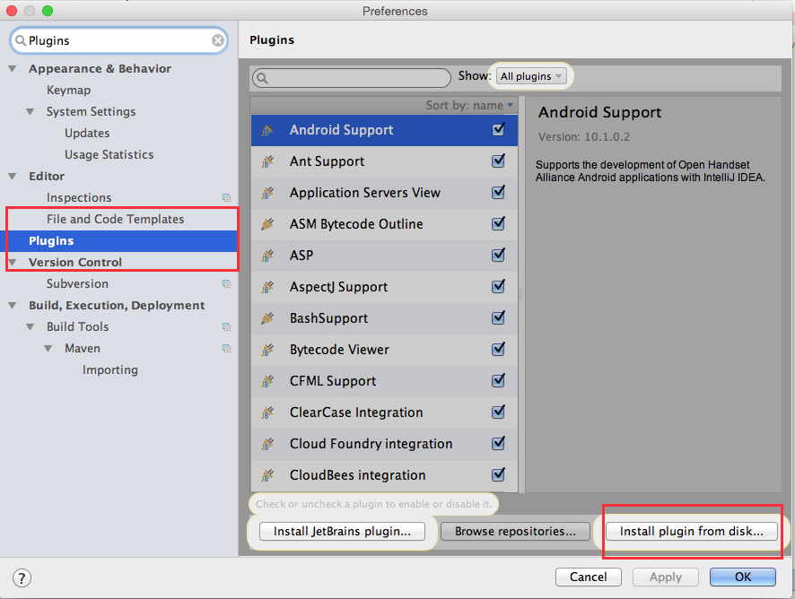
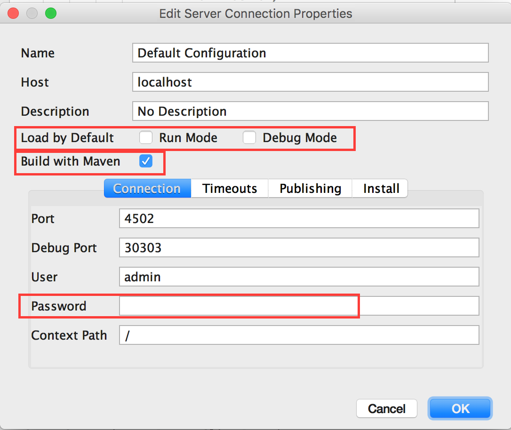
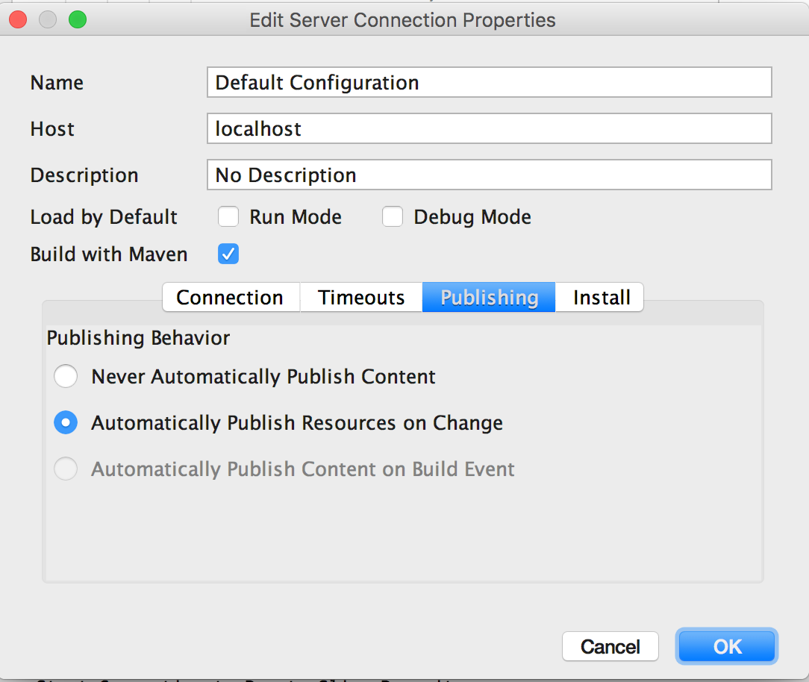
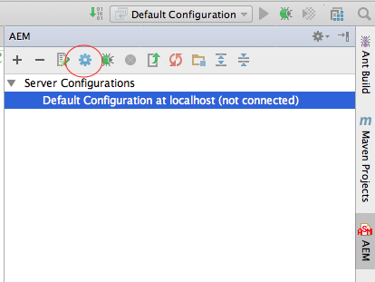
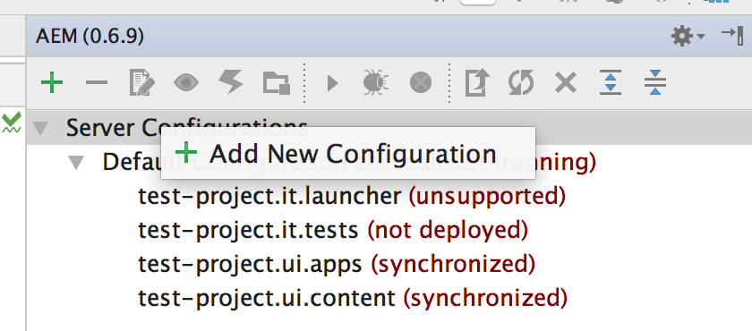

###AEM Tooling Plugin for IntelliJ IDEA

####Introducation

This is a plugin for IntelliJ IDEA version 14 and up that enables the user to develop, deploy and debug applications on a remote AEM Server. It is modelled after the Eclipse plugin but works slightly different due to the different philosophy behind IDEA.

#### Installation

The plugin is distributed as ZIP file and can be installed into IntelliJ quite easily. These are the steps to do so:

1) Start IntelliJ  
2) Open the Preferences  

3) Search for Plugins  
4) Click on **Install plugin from disk**  

5) Select ZIP file and click Ok  
6) Restart IntelliJ  
7) Go back to the Preferences, Plugins and make sure it is listed there  

This concludes the initial setup for any project that do **not** have any OSGi services with **annotations**. In order to support the following external plugin must be installed as well:

1) Open the IntelliJ Preferences again, go to Plugins 

2) Search for **Felix** and select the **Felix OSGi Annotation Processor Plugin**, then click on **Install Plugin**  

3) Accept the Download and Installation of the Plugin  

4) Accept the Restart of IntelliJ to activate the Plugin  

The **Felix OSGi Annotation Processor** is hooking into the compilation process and at the end of it it will handle the **Annotation**similar to what the Maven OSGi Bundle plugin does. So when the compilation concludes the created class has the additional methods defined like **bind...()** and **unbind...()**.

#### Project Setup

**Attention**: this plugin can only work with a **Maven** based project as it requires some information that are otherwise not attainable. 

To deploy and debug the remote AEM server the plugin needs to know which sever to connect to, user and password etc. For that the user needs to create at least one **Server Configuration**. It is possible to have multiple server configurations and to deploy to each of them separately.
A Server Configuration is created by clicking on the plus (+) icon. After the creation the Server Configuration can be edited by the edit icon (3rd from the left). Configuration are only created / stored when the configuration is valid and finished by clicking on the **Ok** button. Otherwise the changes are discarded. So here we go:

1) Open the Plugin by clicking on its Icon (if not already opened)  

2a) To Create: Click on the plus (+) icon  

 
 
2b) To Edit: Select a Configuration and click on the edit icon  

3) Enter the necessary info for the host  

**Note**: Default means that if the plugin is opened this server configuration will be automatically checked and selected. There is only one server configuration allowed to be default.  

4) Edit the timeouts (not supported yet)  

**Attention**: as of now the OSGi Client does not support configurable timeouts and the Debug Connection does not need one.

5) Edit the Publishing

**Attention**: the automatic deployment of changed resources can be disabled but for now the automatic deployment on Maven build is not supported.  

6) Edit the Installation

**Attention**: because IntelliJ IDEA does not support incremental build in a Maven project the installation directly from the File System is disabled.

##### Plugin Configuration

The AEM Plugin has a single property that can be configured. Opening the IntelliJ Preferences and go to the **Other Settings** and you can enable / disable the **incremental builds**. This setting will enable or disable the automatic compilation while saving a Java class file similar to Eclipse.

#### Check against AEM Server

**Attention**: in order to work on a Server Configuration you need to have one selected and this one is then use to check or connect to. Beside the Debug Connection which is established connection all actions are executed against the current selected configuration aka server. That said in order to prevent deployment to different servers if there is a checked or connected server then you can only check and deploy against this server. You need to stop that connection in order to deploy to another server.

**Note**: Selecting the Server Configuration or the Module is the same in this context. 

Checking against the currently selecred AEM Server is creating or updating the project module in the server configuration, checking if the Support Bundle is installed and see if the current resources are update to date or out of date.
If a Server Connection is marked as **default** then this will be happening automatically when the plugin is opened for the first time.

In order to check you need to click on the **gear** icon:

Then you will see the Configuration and its Modules together with their states:

#### Deploy the Modules

**Attention**: OSGi Modules are deployed as a JAR file and so the Maven module has to be built beforehand. Afterwards the JAR file can be deployed as OSGi Module to the AEM OSGi container.

There are two ways to deploy the modules:  
1) Deploy the OSGi Modules and **any changed** resource files  
2) Force Deploy the OSGi Modules and **all** resource files

The deployment of the resource files can take some time depending on the number of changed fileas. After an initial deployment the deployment should be much quicker as only the changed reosurces are deployed which normally only happen when files are changed outside of IntelliJ IDEA.

The **forced** deployed will take its time as all resource files are deployed. This option should only be used when the project is out of sync with the server.

This are the icon to deploy the modules:

#### Deploy of Selected Module

If a Module is selected inside the Server Configuration Tree then only **this** module is deployed. The same thing applies to the Context Menu (see below).

#### Manage Modules

Modules can be **excluded** from the **Deployment** so that the resourc files or OSGi packages are not synced with / deployed on the server. Any exlcuded files can be included again.

To bring up the build click on the **Manage Build Configuration** icon:

This will bring up a Dialog where the Modules are listed. The left side are the excluded and the right side are the included modules. In order to exclude or include a module select the module and click the appropriate button to move it to the other side:

#### Context Menu Options

All of the Toolbar Actions can be executed from the Context Menu inside the plugin window. The selection depends on the current selection and its current state. The root entry (Server Configurations) will only provid **Add New Configuration** but all others will provide all the actions which some might be enabled or disabled.

This is the Root Entry Context Menu:

This is a Server Configuration Context Menu:

Finally this is a Module Context Menu:

#### Debugging the Code on AEM Server

In order to debug code on the AEM Server the AEM server must be started in debug mode which requires these properties to be added to the startup:

	-agentlib:jdwp=transport=dt_socket,server=y,suspend=n,address=30303

In this example 30303 is the **Debug Port** and can be adjusted to your needs as long as it does not conflict with any other TCP/IP ports used especially the AEM Server HTTP port (normally 4052).

Keep in mind that **server=y** means the AEM Server is the target of the debug connection and cannot be changed.

After the AEM Server is up you can connect from the plugin.

#### Setting up a New Maven Project

In order to have a good starting point it is best to create a new Maven based on the **Adobe Maven Archetypes** which will generate a base project. That project can then be easily imported into IntelliJ IDEA by **Open** just that the root **pom.xml** file.

For more information about the Archetypes head over to its [GitHub Project Page](https://github.com/Adobe-Marketing-Cloud/aem-project-archetype) and checkout their description.

**Attention**: what the description forgets to mention is that if you don't have the Adobe repo in your Maven **settings.xml** then it will fail. If you have many projects then you might want to use a project specific settings file which would look like this:

	<?xml version="1.0" encoding="UTF-8"?>
	<settings xmlns="http://maven.apache.org/SETTINGS/1.0.0" 
	          xmlns:xsi="http://www.w3.org/2001/XMLSchema-instance" 
	          xsi:schemaLocation="http://maven.apache.org/SETTINGS/1.0.0 http://maven.apache.org/xsd/settings-1.0.0.xsd">
  
	<!-- This will not work with anyone that works outside of the Xilinx Network
	    <mirrors>
	        <mirror>
	             <id>nexus</id>
	            <name>Xilinx Nexus Server</name>
	            <url>http://wem-tools:8081/nexus/content/groups/public/</url>
	            <mirrorOf>external:*</mirrorOf>
	        </mirror>
	    </mirrors>
	-->
	    <profiles>
	      <profile>
			<id>cq</id>
			<activation>
				<activeByDefault>true</activeByDefault>
			</activation>
			<repositories>
				<repository>
					<id>adobe</id>
					<name>Adobe Repository</name>
					<url>http://repo.adobe.com/nexus/content/groups/public/</url>
					<releases>
						<enabled>true</enabled>
					</releases>
					<snapshots>
						<enabled>false</enabled>
					</snapshots>
				</repository>
			</repositories>
			<pluginRepositories>
				<pluginRepository>
					<id>adobe-plugins</id>
					<name>Adobe Plugin Repository</name>
					<url>http://repo.adobe.com/nexus/content/groups/public/</url>
					<releases>
						<enabled>true</enabled>
					</releases>
					<snapshots>
						<enabled>false</enabled>
					</snapshots>
				</pluginRepository>
			</pluginRepositories>
		</profile>
	  </profiles>
	</settings>

Then you just add
	-s ./settings.xml
to your Maven command line and you will be able to generate your project.

An example for the generation of a project would be like this:

	mvn archetype:generate \
	-DarchetypeGroupId=com.adobe.granite.archetypes \
	-DarchetypeArtifactId=aem-project-archetype \
	-DarchetypeVersion=10 \
	-DgroupId=com.test.sample \
	-DartifactId=sample-aem-project \
	-Dversion=1.0.0-SNAPSHOT \
	-Dpackage=com.test.sample \
	-DappsFolderName=aemsampleapps \
	-DartifactName='Sample AEM Project' \
	-DcomponentGroupName=aemsample \
	-DcontentFolderName=aemsamplecontent \
	-DcssId=asp \
	-DpackageGroup=aemsamplecontent \
	-DsiteName='AEM Project Sample' \
	-s ./settings.xml

The first three options are setting up the Maven project. The **package** is the Java package of your Java source code (OSGi Services, tests etc). The **appsFolder** is the name of the folder underneath **/apps** in the JCR tree. The **DartifactName** is the description of the Maven project. **componentGroupName** is the name of the Group that the Components are placed in inside the Components Dialog. The **contentFolderName** is the name of the folder you content will be placed under the **/content** folder. The **packageGroup** is the group name of the apps / content package.

You can ommit all properties that don't start with **archeytpe** and it will ask you with a prompt.

Here is a list of all supported archetypes:

#### Troubleshooting

##### Installation

If the installation or startup of the plugin fails please have a look at the idea.log and report any errors / exceptions. The plugin is designed for IntelliJ **14 and up** and your milage may wary with older versions.

##### Configuration

If you can connect to your AEM Server through a web browser you should be able to connect to it through the plugin. That said for the the Debug Connection the port must be opened for you in order to debug. It is also prefereable to keep the server for development close to reduce the lag and latency.
If the Debug Connection is failing for unknown reasons then a TCP Proxy can be used to watch the conversation between the IDEA and AEM. A good tool for that is [The Grinder](http://grinder.sourceforge.net/g3/tcpproxy.html) which can be installed quicly and reports any traffic between IDEA and AEM. In order to make it work you need to set the outgoing connection port ot the debug port of the AEM server and the incoming connection port to the port configured in the plugin and they must be different. Then you can connect to the AEM Server through the proxy and you might be able to see why the connection fails.

###### Password

The password in the Server Configuration is left empty so that when the password is changed it is justed tipped in. The password field is empty the password remains as is and does not have to be retipped.

##### Connection

If the Server is checked (to see if the modules / resources are up to date) the connection will close. That said in order to prevent accitendal switches between servers the connection must be closed even if the connection was just used to check. After the connection is closed the user can check, connect or deploy to another server.

##### Deployment

The plugin will not check OSGi dependencies and successful activation of modules. OSGi can deploy a module successfully but fail to activate or to enable a component. 

It is **recommended** to make a full deployment of the project at the beginning of major changes including pulling changes from GIT to ensure that everything is properly deployed. Afterwards Resources, OSGi Modules and classes can be deployed incrementely.

###### Hot Swap

When the plugin is connected in **Debug Mode** to the remote AEM Server a class can be hot swapped if there were only changes made to **method bodies**. Hot Swap will fail if there are any changes made to the class (adding methods, adding members, changing method signatures etc). If the automatical compilation is enabled the HotSwapping is done whenever a Java file is saved.

Because the Hot Swap is done automatically class changes will cause an error during deployment. Therefore regular development should be done with the Debug Connection closed.

**Attention**: HotSwap will replace class code **in memory only** meaning that a restart of the AEM Server will wipe any changes. It is necessary to deploy OSGi modules as soon as possible to avoid irratic changes.

